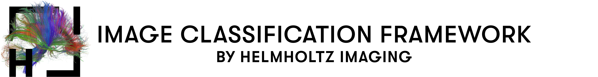

<div align="center">
<p align="left">
  
</p>

<a href="https://www.python.org/"></a>
<a href="https://pytorch.org/get-started/locally/"></a>
<a href="https://pytorchlightning.ai/"></a>

<a href="https://pytorch-lightning.readthedocs.io/en/stable/api/pytorch_lightning.loggers.wandb.html#wandb"></a>
<a href="https://hydra.cc/"></a>
<a href="https://black.readthedocs.io/en/stable"></a>
</div>


This repository contains a framework for training deep learning-based classification and regression models 
with Pytorch Lightning. \
It comprises several architectures, regularization, augmentation and training techniques and
aims to provide easy-to-use baselines for experimenting with a lot of different setups. \
You can also integrate your own model and/or dataset and benefit from the features of this repository! \
Results of experiments on CIFAR-10 comparing different architectures in different training settings are shown below. \
Everything can be run via the Command Line Interface and with Hydra config files. Logging is accomplished by Weights&Biases. \
Training uses mixed precision, torch.compile and `torch.backends.cudnn.benchmark=True` by default to increase training speed. \
Detailed CIFAR results and used configurations can be seen in [CIFAR Results](#cifar-results).
Best performance is achieved with a PyramidNet using RandAugment augmentation, Shakedrop and Mixup.
It yields 0.986 Test Accuracy on CIFAR-10 and 0.875 Test Accuracy on CIFAR-100.


# Table of Contents

* [How to run](#how-to-run)
  * [Requirements](#requirements)
  * [General Usage & Hydra config files](#general-usage-hydra-config-files)
  * [Available models and parameters](#available-models-and-parameters)
    * [Models](#models)
    * [Training Settings](#training-settings)
    * [Data Settings](#data-settings)
    * [Regularization Techniques](#regularization-techniques)
  * [Logging](#logging)
* [Including custom pytorch models](#including-custom-pytorch-models)
* [Including other datasets](#including-other-datasets)
* [CIFAR Results](#cifar-results)


# How to run

## Requirements
First install the requirements in a [virtual environment](https://conda.io/projects/conda/en/latest/user-guide/tasks/manage-environments.html) by:

```shell
pip install -r requirements.txt
```

You might need to adapt the cuda versions for torch and torchvision. 
Find a torch installation guide for your system [here](https://pytorch.org/get-started/locally/). 

## General Usage & Hydra config files

Everything in this repository can be run by executing the ```main.py``` script with a corresponding configuaration.
We use [Hydra](https://hydra.cc/) for config management. All config files are stored in the ```cli_configs``` directory:

```
.
├── cli_configs/
│   ├── train.yaml
│   ├── data/
│   │   └── cifar10.yaml
│   │   └── imagenet.yaml
│   │   └── poster_regression.yaml
│   │   └── ...
│   ├── env/
│   │   └── local.yaml
│   │   └── cluster.yaml
│   └── model/
│       └── convnext.yaml
│       └── resnet.yaml
│       └── efficientnetv2.yaml
│       └── ...      
└── ...
```
The ```train.yaml``` defines all default values. The other 3 subdirectories define config groups that can be used to overwrite specific values. The three config groups are data, environment and model. Inside the data config group each dataset has its own yaml file defining any dataset specific settings like batch size, augmentations, number of classes etc. The environment config group defines the paths to the data directory as well as the experiment directory where logs are saved and sets environment specific variables, e.g. the progress bar gets disabled in a cluster environment. The model config group contains configs for all available models. 

You can start training by simply calling the ```main.py``` and add the config groups you want. Here is an example of training an EfficientNetV2 on CIFAR-10 in the local environment:

```shell
python main.py env=local model=efficientnetv2 data=cifar10
```

Each defined config variable can be overwritten either in the command line or by directly modifiying the yaml files for permanent changes. New yaml files can be added, e.g. a new env config defining paths for your specific environment. Final configurations depend on the order, i.e. a variable that is defined in several config files or in the command line will always get the ***last*** defined value. 

For overwriting the default EfficientNetV2 model type ```S```, you can directly change the value in the ```cli_configs/model/efficientnetv2.yaml``` file or simply use the command line:

```shell
python main.py env=local model=efficientnetv2 data=cifar10 model.type=M
```

It is possible to define default config groups by specifying them at the top of ```train.yaml```. They are used when no other config groups are specified in the command line.
By default they are set to:
```
defaults:
  - _self_          # all variables defined in train.yaml
  - env: local      # local environment
  - model: resnet   # ResNet18
  - data: cifar10   # training on CIFAR-10
```

## Available models and parameters

If you want to include your own model please see [Including custom models](#including-custom-pytorch-models) for instructions. See [Including custom datasets](#including-other-datasets) for instructions on using your own datasets.

The following models and parameters are available out of the box:
<details><summary>

### Models
</summary>

* [EfficientNetV2](https://arxiv.org/pdf/2104.00298.pdf)
   * ```model=efficientnetv2```
   --------------------
  * EfficientNetV2 - L
    * ```model.type=L```
  * EfficientNetV2 - M
    * ```model.type=M```
  * EfficientNetV2 - S
    * ```default```
  --------------------
* [ConvNeXt](https://arxiv.org/pdf/2201.03545.pdf)
    * ```model=convnext```
    --------------------
  * ConvNeXt - large
    * ```model.type=large```
  * ConvNeXt - base
    * ```model.type=base```
  * ConvNeXt - small
    * ```default```
  * ConvNeXt - tiny
    * ```model.type=tiny```
  --------------------
* [PyramidNet](https://arxiv.org/pdf/1610.02915.pdf)
    * ```model=pyramidnet```
    --------------------
  * PyramidNet272 (depth 272, alpha 200)
    * ```model._target_=models.pyramidnet.PyramidNet272```
  * PyramidNet110 (depth 110, alpha 270)
    * ```default```
  --------------------
* [WideResNet](https://arxiv.org/pdf/1605.07146.pdf)
    * ```model=wide_resnet```
    --------------------
  * WRN2810 (depth 28, widen factor 10)
    * ```default```
  --------------------
* [ResNet](https://arxiv.org/pdf/1512.03385.pdf)
    * ```model=resnet```
    --------------------
  * ResNet152
    * ```model._target_=models.dynamic_resnet.ResNet152```
  * ResNet50
    * ```model._target_=models.dynamic_resnet.ResNet50```
  * ResNet34
    * ```model._target_=models.dynamic_resnet.ResNet34```
  * ResNet18
    * ```default```
  --------------------
* [PreActResNet](https://arxiv.org/pdf/1603.05027.pdf)
    * ```model=preact_resnet```
    --------------------
  * PreActResNet152
    * ```model._target_=models.preact_resnet.PreActResNet152```
  * PreActResNet101
    * ```model._target_=models.preact_resnet.PreActResNet101```
  * PreActResNet50
    * ```model._target_=models.preact_resnet.PreActResNet50```
  * PreActResNet34
    * ```model._target_=models.preact_resnet.PreActResNet34```
  * PreActResNet18
    * ```default```
  --------------------
* [VGG](https://arxiv.org/pdf/1409.1556.pdf)
    * ```model=vgg```
    --------------------
  * VGG16 (uses batch norm, does not include the fully connected layers at the end)
    * ```default```
  * VGG19 (uses batch norm, does not include the fully connected layers at the end)
    * ```model._target_=models.dynamic_vgg.VGG19```
  
</details>

#

<details><summary>

### Training Settings
</summary>

By default, the following training settings are used:
* Epochs: 200 | ```trainer.max_epochs=200```
* Batch Size: 128 | ```data.module.batch_size=128```
  * If you set the number of GPUs > 1, your effective batch size becomes num_gpus * batch_size
* Optimizer: SGD (momentum=0.9, nesterov=False) | ```model.optimizer=SGD```
  * for enabling nesterov use ```model.nesterov=True``` (SGD only)
  * other available optimizers are:
    * [Madgrad](https://arxiv.org/pdf/2101.11075v2.pdf) | ```model.optimizer=Madgrad```
    * [Adam](https://arxiv.org/pdf/1412.6980.pdf) | ```model.optimizer=Adam```
    * [AdamW](https://arxiv.org/pdf/1711.05101v3.pdf) | ```model.optimizer=AdamW```
    * [RmsProp](https://www.cs.toronto.edu/~tijmen/csc321/slides/lecture_slides_lec6.pdf) | ```model.optimizer=Rmsprop```
    
* Learning Rate: 0.1 | ```model.lr=0.1```
* Weight Decay: 5e-4 | ```model.weight_decay=5e-4```
* Scheduler: [Cosine Annealing](https://arxiv.org/pdf/1608.03983v5.pdf) | ```model.scheduler=CosineAnneal```
    * includes [Gradual Warmup](https://arxiv.org/pdf/1706.02677.pdf) | ```model.warmstart=10```
      * linearly increases the LR to the initial LR for specified amount of epochs
      * Parameter: Int - Number of epochs to warm up
      * Default: 0
      * Value used in experiments: 10
  * other available LR schedulers are:
    * MultiStep (multiply LR with 0.1 after 1/2 and 3/4 of epochs) | ```model.scheduler=MultiStep```
    * Step (multiply LR with 0.1 every 1/4 of epochs) | ```model.scheduler=Step```

* Seed: None
  * Specify a seed with ```seed=<your_seed>```
  * Disables cudnn.benchmark flag (required to make training deterministic) which results in slower training
* Number of workers in dataloaders: 12 | ```data.module=num_workers 12```
* Number of GPUs | ```trainer.devices=1```
  * If > 1 training will be executed on multiple GPUs following ddp strategy, ```sync_batchnorm``` will be automatically enabled
  * For CPU training set ```trainer.accelerator=CPU```
</details>

#

<details><summary>

### Data Settings
</summary>

Additionally, you can adapt the following parameters to your data.
* Dataset | ```data=cifar10```
  * You can choose any of the other data config groups to train on other datasets
  * See [Including custom datasets](#including-other-datasets) for using your own data
  * See [here](https://image-net.org/challenges/LSVRC/2012/2012-downloads.php) for instructions to download Imagenet
* Number of classes | ```data.num_classes=10```
* Specifiy the task | ```model.task=classification```
  * for regression set ```model.task=regression```
* Train Augmentation | ```data.module.train_transforms._target_=augmentation.policies.cifar.RandAugmentTransform```

  Val/Test Augmentation   | ```data.module.test_transforms._target_=augmentation.policies.cifar.TestTransform```
  * Depending on the dataset there are different augmentation policies predefined. The following are used for the experiments on CIFAR-10. Generally you can define paths to any other augmentations you defined.
    * CIFAR:
      * Baseline (Random Crop, Random Horizontal Flips and Normalization) | ```data.module.train_transforms._target_=augmentation.policies.cifar.BaselineTransform```
      * Baseline + [Cutout](https://arxiv.org/pdf/1708.04552.pdf) (cutout size 16 for CIFAR10 and size 8 for CIFAR100) | ```data.module.train_transforms._target_=augmentation.policies.cifar.BaselineCutoutTransform```
      * Baseline + Cutout + [AutoAugment](https://arxiv.org/pdf/1805.09501.pdf) | ```data.module.train_transforms._target_=augmentation.policies.cifar.AutoAugmentTransform```
      * Baseline + Cutout + [RandAugment](https://arxiv.org/pdf/1909.13719.pdf) | ```data.module.train_transforms._target_=augmentation.policies.cifar.RandAugmentTransform```
* Number of Input Dimensions | ```model.input_dim=2```
  * At the moment only available for ResNets and VGGs
  * Specifies the number of dimensions of your data and chooses dynamically the corresponding 1D, 2D or 3D model operations
* Number of Input Channels | ```model.input_channels=3```
  * At the moment only available for ResNets and VGGs
  * Specifies the number of channels of your data, e.g. 1 for grayscale images or 3 for RGB, and adapts the model architecture accordingly
* Very small images | ```model.cifar_size=True```
  * At the moment only available for ResNets and VGGs
  * If used, more lightweight architectures designed for smaller images like CIFAR are used
</details>

#

<details><summary>

### Regularization Techniques
</summary>

Moreover, there are several additional techniques available that are all disabled by default. 
The following techniques are available for all models:
* [Label Smoothing](https://www.cv-foundation.org/openaccess/content_cvpr_2016/papers/Szegedy_Rethinking_the_Inception_CVPR_2016_paper.pdf) | ```model.label_smoothing=0.1```
    * Reduces overfitting and overconfidence by mixing the labels with the uniform distribution
    * Parameter: Float - determines amount of smoothing
    * Range: 0.0 (no smoothing) - 1.0 (full smoothing)
    * Default: 0.0
    * Value used in experiments: 0.1
    * Only for Classification
* [Mixup](https://arxiv.org/pdf/1710.09412.pdf) | ```model.mixup=True model.mixup_alpha=0.2```
    * Data augmentation technique that generates a weighted combination of random image pairs from the training data
    * Parameter: mixup: bool (apply mixup or not), mixup_alpha: Float - controls the strength of interpolation between feature-target pairs
    * Range: 0.0 (no mixup) - 1.0 (very heavy mixup)
    * Default: 0.2 if ```--mixup``` is specified, otherwise 0.0
    * Value used in experiments: 0.2 (if mixup was used)
* [Sharpness Aware Minimization](https://arxiv.org/pdf/2010.01412.pdf) | ```model.sam=True```
    * Additional optimization that uses any optimizer as base optimizer but specifically seeks parameters that lie in neighborhoods having uniformly low loss
    * Parameter: bool
    * SAM trains significantly longer as it requires two forward-backward passes for each batch and disables 16-bit precision, set ```trainer.precision=32```
    * It is recommended to train half of the epochs you would usually do
* [Disable weight decay for batchnorm parameters as well as bias](https://arxiv.org/pdf/1812.01187.pdf) | ```model.undecay_norm=True```
    * Applies weight decay only to weights in convolutional and fully connected layers
    * Parameter: bool


The following techniques can only be used with ResNet-like models (including PyramidNets and WideResNets):

* [Stochastic Depth](https://arxiv.org/pdf/1603.09382.pdf) | ```model.stochastic_depth=0.1```
    * Randomly drops some building blocks in ResNet-like models
    * Parameter: Float - determines the drop probability
    * Range: 0.0 (no dropping) - 1.0 (drop all)
    * Value used in experiments: 0.1
* [Shakedrop](https://arxiv.org/pdf/1802.02375.pdf) | ```model.shakedrop=True```
    * Shake: Applies random perturbation by noise addition to the output of a residual branch
    * Drop: Applies Shake randomly starting with very low probability and linearly increasing probability up to 0.5 in final layer
    * Parameter: bool
    * Authors recommend training 6 times longer with shakedrop than you would normally do
* [Squeeze and Excitation](https://arxiv.org/pdf/1709.01507.pdf) | ```model.squeeze_excitation=True```
    * Adds a Squeeze & Excitation Layer to the end of the encoding part of the network
    * Squeeze: Aggregates feature maps across their spatial dimensions to an embedding allowing all layers to use the global receptive field of the network
    * Excitation: Takes the embedding as input and produces per-channel modulation weights, so that it enables the network to adapt the weighting of CNN feature maps
    * Parameter: bool
* [Final Layer Dropout](https://jmlr.org/papers/volume15/srivastava14a/srivastava14a.pdf) | ```--model.resnet_dropout=0.5```
    * Applies Dropout right before the network's final output
    * Parameter: Float - determines the drop probability
    * Range: 0.0 (no dropout) - 1.0 (always drop)
    * Value used in experiments: 0.5
* [Zero initialization of the residual](https://arxiv.org/pdf/1812.01187.pdf) | ```model.zero_init_residual=True```
    * Initializes the last layer (most often batchnorm) of a residual block with zeros so that residual blocks return their inputs (easier to train in the initial state)
    * Parameter: bool
* [Bottleneck](https://arxiv.org/pdf/1512.03385.pdf) | ```model.bottleneck=True```
    * Using bottleneck building blocks instead of basic building blocks
    * Parameter: bool
</details>


#
## Logging
[Weights&Biases](https://wandb.ai/site) is used for logging all hyperparameters, metrics, terminal output, system metrics such as GPU utilization etc. You can create an account for free. However, if you don't want to create an account you can still use this repository. W&B will display a link in the beginning of training where you can find all your logs, but they will be deleted after 7 days if you don't have an account. We recommend to create an account. 

The name of your dataset is automatically used as project name. You can adjust the project name by overwriting 
```
trainer.logger.project=<PROJECT_NAME>
```

Moreover, additional plots depending on the task are saved. For classification a confusion matrix is automatically logged for the validation set. You can also log one for the train set or disable it completely by overwriting the default value `val`:
```
model.result_plot=all  # logs train and val plot
model.result_plot=disable  # does not log plots
```
In the case of a regression task a parity plot is logged showing ground truth and predicted regression targets instead of a confusion matrix.


# Including custom pytorch models

For including your own models follow these steps:
1. In the `./models` folder create a file `<your-model>.py` and import your model.
2. Create a class that inherits from the `BaseModel` and define the `__init__` and `forward` functions. Initialize your model in the `__init__` function. Here is an example for a model that expects the arguments `num_classes`, `stochastic_depth_prob` and `some_new_argument`:

    ```python
    from my_custom_models import custom_model  # your model
    from base_model import BaseModel  # customized LightningModule

    class CustomModel(BaseModel):
        def __init__(self, **kwargs):
            super(CustomModel, self).__init__(**kwargs)

            self.model = custom_model(
                num_classes=kwargs["num_classes"],
                stochastic_depth_prob=kwargs["stochastic_depth"],
                some_new_argument=kwargs["some_new_argument"]
                ...  # any other arguments
            )
            
        def forward(self, x):
            return self.model(x)
    ```
    Note that `**kwargs` is passed to the `__init__` and the super init. These are all arguments defined in the model config group (i.e. all variables starting with `model.<variable>`). You can use existing variables like `num_classes` or you can define new ones and simply add them to your config files.
3. Create a `<your-model>.yaml` file in the model config group. Add the path to your `CustomModel` created in step 2, default parameters you want to use with this model and if applicable default values for new arguments. Here is an example:

    ```yaml
    _target_: models.custom_model.CustomModel
    stochastic_depth: 0.2
    some_new_argument: <some-value>
    ``` 
    Note that `num_classes` is not defined here since it is usually defined in the data config file. 

That's it!
Note that the techniques Stochastic Depth, Shakedrop, Squeeze & Excitation, Final Layer Dropout and Bottleneck require architectural changes and cannot be 
made available automatically for a custom model. All other functionalities of this repository are now also available for your model.
You can now train your model e.g. with RandAugment, Mixup, Madgrad Optimizer and a Cosine Annealing LR scheduler with warmstart of 5 epochs all out of the box like this:
```shell
python main.py model=custom_model model.lr=0.0001 model.optimizer=Madgrad model.scheduler=CosineAnneal model.warmstart=5 model.mixup=True data.module._target_=augmentation.policies.cifar.AutoAugmentTransform
```

# Including other datasets

For including your own dataset follow these steps:
1. In the ```dataset``` directory create a new file that implements the [torch dataset](https://pytorch.org/tutorials/beginner/basics/data_tutorial.html#creating-a-custom-dataset-for-your-files) class for your data.
2. Additionally, create the [DataModule](https://lightning.ai/docs/pytorch/stable/data/datamodule.html) for your dataset by writing a class that inherits from `BaseDataModule`. Write the `init` and `setup` functions for your dataset. The dataloaders are already defined by the `BaseDataModule`. An example could look like this:
    ```python
    from .base_datamodule import BaseDataModule

    class CustomDataModule(BaseDataModule):
      def __init__(self, **params):
          super(CustomDataModule, self).__init__(**params)

      def setup(self, stage: str):
          self.train_dataset = YourCustomPytorchDataset(
              data_path=self.data_path,
              split="train",
              transform=self.train_transforms,
          )
          self.val_dataset = YourCustomPytorchDataset(
              data_path=self.data_path,
              split="val",
              transform=self.test_transforms,
          )
    ```
    Note that the `__init__` function takes `**params` and passes them to the super init. By doing so the attributes `self.data_path`, `self.train_transforms` and `self.test_transforms` are already set automatically and can be used in the `setup` function. The `self.data_path` is a joined path consisting of the configs `data.module.data_root_dir` and `data.module.name`. 
    Custom transforms can be added in `./augmentation/policies/<your-data>.py`. They need to inherit from the `BaseTransform` class. See the existing transforms for examples!
3. Add a `<your-data>.yaml` file to the data config group, defining some data-specific variables. For CIFAR-10 it looks like this:
    ```yaml
    # @package _global_
    data:
      module:
        _target_: datasets.cifar.CIFAR10DataModule
        name: CIFAR10
        batch_size: 128
        train_transforms: 
          _target_: augmentation.policies.cifar.RandAugmentTransform
          cutout_size: 8
        test_transforms: 
          _target_: augmentation.policies.cifar.TestTransform

      num_classes: 10

    model:
      task: 'Classification'
      cifar_size: True
    ```
    The `data.module._target_` defines the path to your `DataModule`. Note that the first line of the file needs to be `# @package _global_` in order for Hydra to read the config properly.

That's it! You can now use all training pipelines, regularization techniques and models with your dataset.

# CIFAR Results

The following experiments aim to show general tendencies for different training settings and techniques. In order 
to be consistent with the literature we evaluate all our experiments on the respective test sets. We are aware of 
problems resulting from this experimental setup and would like to emphasize that test set optimization should never 
be done when developing new methods or making claims about the generality of the results. A proper experimental setup 
should always include a validation set which is used for hyperparameter optimization. Thus, all of the following 
experiments are merely intended to provide general tendencies without any guarantee that they will generalize to unseen 
data.

### Best test accuracies by each model


The following table shows the exact configurations that were used to achieve the stated test accuracies on CIFAR-10 and CIFAR-100.
Note that not all possible combinations of parameters were tested. Therefore, one shouldn't draw any conclusions about single
parameters. The table only aims to enable reproducibility. 
Please see the experiments in the following sections for an evaluation of individual techniques. 


| Model        | epochs|LR  | Optimizer  |Nesterov|Scheduler| Warmstart|Weight Decay|Augmentation|Undecay Norm|Label Smoothing|Stochastic Depth|Mixup|Final Layer Dropout|Squeeze & Excitation|Shakedrop|Zero-Init-Residual|CIFAR10 Test Acc|CIFAR100 Test Acc|
| -------------|:---:|:-----:| :-----:| :-----:| :-----:| :-----:| :-----:| :-----:|:-----:|:-----:|:-----:|:-----:|:-----:|:-----:|:-----:|:-----:|:-----:|:-----:|
| PyramidNet110 | 1800| 0.05   | SGD|False|CosineAnneal  | 0 | 5e-5 | RandAugment |False| 0.0 | 0.0 | True| 0.0|False|True|False|0.9864|0.8746
| PyramidNet272 | 1800| 0.05   | SGD|False|CosineAnneal  | 0 | 5e-5 | AutoAugment |False| 0.0 | 0.0 | False| 0.0|False|True|  False|0.9836|0.8728
| WRN2810 | 1800| 0.1   | SGD|False|CosineAnneal  | 0 | 5e-4 | AutoAugment |False| 0.0 | 0.0 | False| 0.0|False|False|False|  0.9775|0.8407
| PreActResNet152 | 200| 0.1   | SGD - SAM|False|CosineAnneal  | 10 | 5e-4 | RandAugment |False| 0.0 | 0.0 | False| 0.0|False|False| False| 0.9741|0.8310
| ResNet152 | 200| 0.1   | SGD |True|CosineAnneal  | 0 | 5e-4 | AutoAugment |False| 0.0 | 0.0 | False| 0.0|False|False| True| 0.9739|0.8249
| PreActResNet50 | 200| 0.1   | SGD - SAM|False|CosineAnneal  | 10 | 5e-4 | RandAugment |False| 0.0 | 0.0 | False| 0.0|False|False| False| 0.9739|0.8247
| ResNet50 | 200| 0.1   | SGD - SAM|False|CosineAnneal  | 0 | 5e-4 | AutoAugment |False| 0.0 | 0.0 | False| 0.0|False|False| False| 0.9735|0.8294
| PreActResNet34 | 400| 0.1   | SGD |False|CosineAnneal  | 10 | 5e-4 | AutoAugment |False| 0.0 | 0.0 | False| 0.0|False|False| False| 0.9730|0.8129
| ResNet34 | 200| 0.1   | SGD - SAM|False|CosineAnneal  | 0 | 5e-4 | RandAugment |False| 0.0 | 0.0 | False| 0.0|False|False| False| 0.9704|0.8195
| PreActResNet18 | 400| 0.1   | SGD |False|CosineAnneal  | 10 | 5e-4 | RandAugment |False| 0.0 | 0.0 | False| 0.0|False|False| False| 0.9680|0.7897
| ResNet18 | 200| 0.1   | SGD - SAM|False|CosineAnneal  | 0 | 5e-4 | RandAugment |False| 0.0 | 0.0 | False| 0.0|False|False| False| 0.9663|0.8038
| VGG16 | 400| 0.1   | SGD |False|CosineAnneal  | 0 | 5e-4 | AutoAugment |False| 0.0 | 0.0 | False| 0.0|False|False| False| 0.9599|0.7782


### Optimizer, Learning Rate and Scheduler

The choice of an optimizer, corresponding learning rate and learning rate scheduler all have a large impact on 
convergence speed and model performance. Here different setups were compared for the ResNet34 model. All versions were 
trained for 200 epochs, using a batch size of 128, AutoAugment augmentation and a weight decay of 4e-5. 
No other regularization techniques or additional settings were used. 
SGD with momentum of 0.9 and no nesterov was compared to Adam (no amsgrad), AdamW (no amsgrad), RMSProp and the recently introduced Madgrad. 
In addition, Sharpness Aware Minimization (SAM) was used with SGD and Madgrad as base optimizers.
The considered learning rate schedulers were Step (multiply lr with 0.1 evey 50 epochs), MultiStep (multiply lr with 0.1 after 1/2 and 3/4
of epochs) and Cosine Annealing without warmstart. Every combination of LR, optimizer and scheduler that is not displayed yielded a score lower than
0.92 and is not shown to give a more clear view on the good performing setups. \
For reproducing e.g. the best SGD - SAM run which yielded more than 0.97 accuracy you can run:

```shell
python main.py model=resnet model._target_=models.dynamic_resnet.ResNet34 model.lr=0.1 model.optimizer=SGD model.sam=True model.scheduler=CosineAnneal data.module._target_=augmentation.policies.cifar.AutoAugmentTransform trainer.max_epochs=200
```

It can be seen that optimizer and LR are highly dependent on each other. While SGD performs better with higher LRs like 0.1, 
the other ones yield better results with much lower LRs. Madgrad yields best results with the smallest LR tested (0.0001).
Moreover, Sharpness Aware Minimization (SAM) always outperformed the respective base optimizer alone. 
Regardless of the optimizer the best scheduler was usually Cosine Annealing.


### Augmentation techniques and Sharpness Aware Minimization (SAM)

Baseline augmentation on CIFAR involves Random Cropping, Random Horizontal Flips (with a 0.5 probability) and Normalization.
In addition, Cutout (with a size of 16 on CIFAR-10 and 8 on CIFAR-100) is added in baseline_cutout. 
It erases a random patch of the image and is able to improve the robustness of the model by simulating occlusions. 
AutoAugment and RandAugment both include the baseline augmentation, then their respective policy and finally also utilize cutout.
While AutoAugment is a set of learned augmentation policies that work well on CIFAR, RandAugment does not have to be learned first 
but applies a subset of transformations randomly. 

Here all models were using either SGD or SGD with SAM as an optimizer, an initial LR of 0.1 and a Cosine Annealing scheduler.
While the SGD models were trained for 400 epochs, the SAM models were trained for 200 epochs to ensure a fair comparison 
(in terms of total training time).
The PreActResNets were all using a gradually increasing warmstart for 10 epochs before starting to decay the LR, because otherwise 
the LR of 0.1 would have been too high for them in the beginning, so they would result in NaNs. The other models did not use a warmstart.
If you e.g. want to reproduce the results of a PreActResNet50 with RandAugment and SGD - SAM optimizer, you can run the following:

```shell
python main.py model=preact_resnet model._target_=models.preact_resnet.PreActResNet50 model.lr=0.1 model.optimizer=SGD model.sam=True model.warmstart=10 trainer.max_epochs=200
```
The respective run with SGD alone would be:
```shell
python main.py model=preact_resnet model._target_=models.preact_resnet.PreActResNet50 model.lr=0.1 model.optimizer=SGD model.warmstart=10 trainer.max_epochs=400
```

Single runs are shown for each augmentation technique with their resulting test accuracy. Adding Cutout to the baseline 
considerably improves the performance of all models. AutoAugment and RandAugment yield very similar results but both consistently
outperform the baselines with and without cutout. 
Moreover, when comparing the performance of the optimizers it can be seen that the influence of SAM varies between augmentations
and model depth. In the case of baseline and cutout augmentation using SAM always improved the final test accuracy significantly, regardless of the model.
However, when using heavier augmentation techniques like AuoAugment and RandAugment SAM only improved performance of deeper models.
VGG16 as well as the (PreAct)ResNets18 and 34 all did not improve using SAM or even performed worse.
On the other hand the PyramidNets and deeper ResNets still yielded better scores when utilizing SAM. 


### Training time comparison


Here the previous runs using AutoAugment are shown with their respective time needed to complete a full training.
In addition, SGD runs with only 200 epochs are depicted. 
All models were trained on a GeForce RTX 2080 Ti.
As expected smaller models usually need less training time but yield lower accuracy. 
The WideResNet 28-10 however, trains faster than the ResNet152 and PreActResNet152 but still performs better.
Training the plain SGD versions for 400 instead of 200 epochs always increases the performance significantly 
except for the ResNet152 and PreActResNet152. As seen in the previous section, SAM used with more complex models 
outperforms the 400 epoch SGD runs. Therefore, when using SAM training for only half of the epochs you would usually do
can be a good trade-off between performance and training time. 


### Adding other techniques

There are several architectural tweaks such as e.g. stochastic depth, general regularization techniques (e.g. mixup) 
and other tricks like using a LR scheduler warmstart or using nesterov accelerated SGD. Find a short description, links to papers
and an explanation how they were used for all techniques in [Available models and parameters](#available-models-and-parameters).
In order to test their effects on the CIFAR datasets each of them was added individually to a baseline model. 
Since final test accuracies can vary for similar runs, all models were trained 5 times. 
The baseline models were trained for 200 epochs, using SGD with a LR of 0.1, a Cosine Annealing scheduler and AutoAugment augmentation. 
The mean test accuracies are depicted by their respective dashed vertical lines. The results of the runs including each 
respective technique are represented by boxplots to show the variance within runs. An example run for a WideResNet using mixup
would be:
```shell
python main.py model=wide_resnet model.lr=0.1 model.optimizer=SGD model.scheduler=CosineAnneal data.module._target_=augmentation.policies.cifar.AutoAugmentTransform trainer.max_epochs=200 model.mixup=True
```
It can be seen that variance in runs is higher for some techniques such as squeeze & excitation while it is rather stable 
for other techniques such as nesterov or mixup. Moreover, different models work differently well with some techniques like
final layer dropout which mostly increases performance of the WideResNet while it harms performance of the other two models.
For all three models not decaying batchnorm and bias decreased test accuracy while using a warmstart, mixup and nesterov 
all increased performance. 


# Acknowledgements

<p align="left">
   &nbsp;&nbsp;&nbsp;&nbsp;
   
</p>

This Repository is developed and maintained by the Applied Computer Vision Lab (ACVL)
of [Helmholtz Imaging](https://www.helmholtz-imaging.de/).