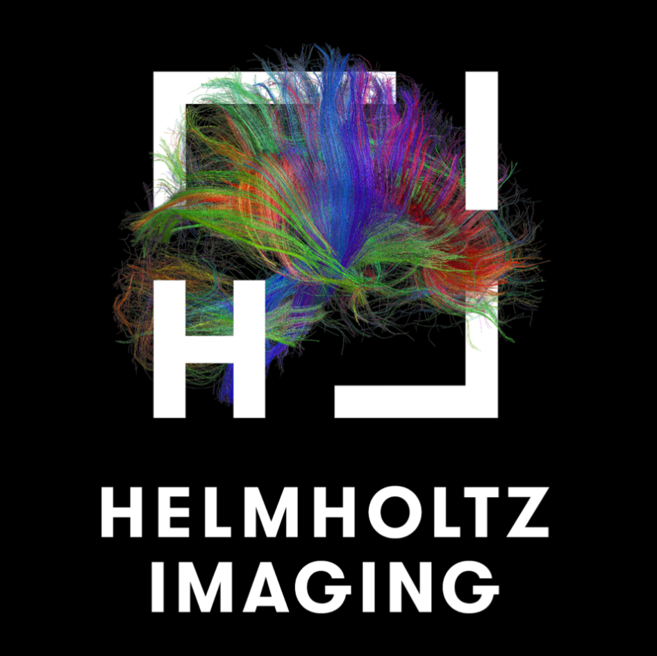

# GloViTa

GloViTa is a PyTorch training stack for whole-sample vision prediction:

- image classification
- image regression
- precomputed-feature training
- bag-of-features MIL
- clip-level video models
- early support for framewise video heads

The project is intentionally built around typed Python configs instead of YAML
files as the primary interface. The main idea is:

- the schema lives in `src/glovita/configs`
- the CLI is generated from that schema with `tyro`
- runtime assembly happens in a small number of central factories
- resolved runtime state is written to disk for reproducibility

This README is the main entrypoint for new users. It explains how the CLI
works, how the config tree is structured, how training runs are laid out on
disk, and how to add new datasets or models.

## What The Project Is Optimized For

GloViTa is optimized for a few explicit design goals:

- explicit configuration over hidden magic
- one typed source of truth for user-facing parameters
- modular composition of `dataset -> transforms -> dataloaders -> model -> PEFT -> trainer`
- easy CLI overrides for experiments
- reproducible run directories with saved config snapshots

Some consequences of those choices:

- most user-facing knobs live in `src/glovita/configs`
- most implementation-specific branching lives in factory modules
- several values are intentionally derived at runtime instead of duplicated in config
- adding a new component usually means:
  - one config class
  - one implementation module
  - one factory branch

For datasets, there is now also a reusable generic image-dataset path for the
common case, so users do not always need to write their own dataset classes.

## Repository Layout

The files new users will touch most often are:

- `glovita_train`: installed training command
- `glovita_infer`: installed checkpoint-based evaluation command
- `glovita_extract_features`: installed feature extraction command
- `glovita_plot_umap`: installed embedding-plotting command
- [src/glovita/configs](src/glovita/configs): all typed user-facing config blocks
- [src/glovita/datasets/factory.py](src/glovita/datasets/factory.py): dataset and dataloader assembly
- [src/glovita/models/factory.py](src/glovita/models/factory.py): encoder/head model assembly
- [src/glovita/augmentation/policies/registry.py](src/glovita/augmentation/policies/registry.py): augmentation policy resolution
- [src/glovita/training/trainer.py](src/glovita/training/trainer.py): main train/validation loop

The implementation tree is roughly:

```text
src/glovita/
├── augmentation/
├── configs/
├── datasets/
├── logging/
├── metrics/
├── models/
│   ├── heads/
│   ├── img_encoder/
│   ├── peft/
│   └── video_encoder/
└── training/
```

## Installation

Install GloViTa in an environment that already has a compatible PyTorch build
for your machine:

```bash
pip install -e .
```

Optional logger backends:

```bash
pip install -e .[wandb]
pip install -e .[mlflow]
```

Notes:

- base installation does not require `wandb`
- base installation does not require `mlflow`
- the selected logger backend is imported lazily at runtime
- `pip install -e .` installs these commands:
  - `glovita_train`
  - `glovita_infer`
  - `glovita_extract_features`
  - `glovita_plot_umap`

## Installed Commands

After installation, use:

```bash
glovita_train
glovita_infer
glovita_extract_features
glovita_plot_umap
```

## Training: The Two CLI Styles

The CLI is generated from the pydantic config schema with `tyro`.

There are two equally valid ways to run things:

- explicit field style
- subcommand shorthand for discriminated unions

The runtime uses underscore-style flags consistently.

### 1. Explicit Field Style

This is the most readable style once you understand the config tree:

```bash
glovita_train \
  --data.dataset cifar10 \
  --data.data_root_dir ./data \
  --model.encoder.encoder_type timm \
  --model.encoder.type resnet50.a1_in1k \
  --model.encoder.no_pretrained \
  --model.head.head_type classification \
  --peft.method full_finetuning \
  --dataloading.batch_size 128
```

Use this style when:

- you want to see the full config path being overridden
- you are scripting runs
- you are new to the project and want the structure to stay obvious

### 2. Subcommand Shorthand

Discriminated-union config blocks can also be selected as subcommands:

```bash
glovita_train \
  --dataloading.batch_size 128 \
  data:cifar10-config --data.data_root_dir ./data \
  model.encoder:timm-encoder-config --model.encoder.type resnet50.a1_in1k --model.encoder.no_pretrained \
  model.head:classification-head-config \
  peft:full-finetuning-config
```

Use this style when:

- you already know which config subclass you want
- you want shorter commands for common runs

## How To Read The Config Tree

The root training config is [RootConfig](src/glovita/configs/root.py). Its main
children are:

- `data`
- `model`
- `peft`
- `task`
- `training`
- `dataloading`
- `optimizer`
- `logger`
- `add_log`

Think of them as:

- `data`: what samples exist and how dataset defaults behave
- `model`: encoder, head, and feature aggregation
- `peft`: which parameters are trainable and how adaptation is done
- `task`: metrics and task-specific training behavior
- `training`: trainer-loop behavior
- `dataloading`: `DataLoader` settings
- `optimizer`: optimizer and scheduler behavior
- `logger`: experiment-tracking backend
- `add_log`: logging-only metadata that never changes runtime behavior

The user-facing config modules are:

- [root.py](src/glovita/configs/root.py): top-level config and output directory rules
- [data.py](src/glovita/configs/data.py): dataset selection and per-dataset defaults
- [augmentation.py](src/glovita/configs/augmentation.py): train/test augmentation choice and overrides
- [dataloading.py](src/glovita/configs/dataloading.py): all PyTorch `DataLoader` parameters used by the runtime
- [model.py](src/glovita/configs/model.py): encoder/head selection and model-family options
- [peft.py](src/glovita/configs/peft.py): PEFT method selection and method-specific parameters
- [optimizer.py](src/glovita/configs/optimizer.py): optimizer and scheduler configuration
- [training.py](src/glovita/configs/training.py): epochs, precision, checkpointing, best-metric selection
- [task.py](src/glovita/configs/task.py): metrics, label smoothing, mixup, plot logging
- [logging.py](src/glovita/configs/logging.py): `wandb`, `mlflow`, or `none`

One especially useful dataset option in [data.py](src/glovita/configs/data.py) is:

- `generic_image_dataset`

Use it when your data is a standard image dataset and you want to avoid writing
a custom `Dataset` class.

## Important CLI Patterns

### Boolean Flags

For many booleans, tyro generates a negative leaf flag. Example:

```bash
--model.encoder.no_pretrained
```

Use `glovita_train --help` to see the exact generated form for a field.

### Nested Override Paths

Most values are overridden by their dotted config path:

```bash
--training.epochs 50
--optimizer.lr 3e-4
--data.augmentation.image_size 224
```

### Logging-Only Metadata

`glovita_train` supports a special logging-only escape hatch:

```bash
glovita_train \
  ... \
  --add_log.comment "scratch baseline" \
  --add_log.dataset_alias CIFAR10_small \
  --add_log.notes.phase warmup
```

These values:

- are saved in the run metadata
- are sent to the selected logger backend
- do not affect the run itself

### Help

Use:

```bash
glovita_train --help
glovita_infer --help
glovita_extract_features --help
glovita_plot_umap --help
```

## A Practical Training Walkthrough

### Minimal CIFAR-10 Example

```bash
glovita_train \
  --data.dataset cifar10 \
  --data.data_root_dir ./data \
  --model.encoder.encoder_type timm \
  --model.encoder.type resnet50.a1_in1k \
  --model.encoder.no_pretrained \
  --model.head.head_type classification \
  --peft.method full_finetuning \
  --training.epochs 2 \
  --dataloading.batch_size 128
```

### Change Only The Augmentation Strength

Dataset configs define defaults, but you can override them directly:

```bash
glovita_train \
  --data.dataset chestxray14 \
  --data.data_root_dir /data/ChestXray14 \
  --data.augmentation.train_policy default_2d_4 \
  --data.augmentation.test_policy shared_default_2d
```

### Use A Different Logger Backend

The default logger backend is `wandb`. To use MLflow:

```bash
glovita_train \
  --data.dataset cifar10 \
  --data.data_root_dir ./data \
  --model.encoder.encoder_type timm \
  --model.encoder.type resnet50.a1_in1k \
  --model.head.head_type classification \
  --peft.method full_finetuning \
  logger:mlflow-logger-config
```

If `--logger.tracking_uri` is unset, MLflow currently defaults to a local store
under `./experiments/mlflow`.

### Select The Best-Checkpoint Metric Explicitly

```bash
glovita_train \
  ... \
  --training.best_checkpoint_metric F1
```

The metric name must match the actual logged validation metric key.

## How Dataset Defaults Work

Dataset defaults are stored in [data.py](src/glovita/configs/data.py).

Each dataset config defines:

- dataset identifier
- `num_classes`
- task type and subtask
- default augmentation policy selection
- optional default `data_fraction`

That means a user can inspect one file and answer:

- which dataset names exist
- what their defaults are
- how many classes they expect
- whether they are multiclass or multilabel

Example:

- `Cifar10Config` defaults to `train_policy="randaugment"` and `test_policy="default"`
- `ChestXRay14Config` defaults to `train_policy="default_2d_2"` and `test_policy="shared_default_2d"`

This is deliberate. User-facing defaults belong in config, not buried in factory
logic.

## Runtime-Derived Values

Some values are derived at runtime instead of being copied into multiple config
blocks. This keeps the schema smaller and avoids contradictory settings.

Current runtime-derived values include:

- classification head output dimension from `data.num_classes`
- encoder preprocessing defaults:
  - `image_size`
  - `resize_size`
  - `mean`
  - `std`
  - `patch_size`
- effective augmentation settings after merging:
  - dataset defaults
  - encoder defaults
  - explicit user overrides
- effective dataloader settings:
  - eval batch size fallback
  - worker-related derived settings
- default logger experiment/group names

Why this is done:

- avoids duplicating the same information in multiple config blocks
- reduces the chance of incompatible settings
- keeps the user-facing schema closer to intent than implementation detail

Resolved runtime state is written to:

- `config.json`
- `resolved_config.json`
- `runtime_info.json`

inside each run directory.

## How Run Directories Work

For each run, the directory layout is:

```text
experiments/
  <dataset>/
    <group>/
      <fold>/
        config.json
        resolved_config.json
        runtime_info.json
        checkpoints/
          last.pt
          best.pt
          epoch_0000.pt
          ...
```

Notes:

- `group` is shared across folds of the same CV run
- the `checkpoints/` directory contains only checkpoints
- config snapshots stay one level above `checkpoints/`

This layout is used by:

- `glovita_infer`
- `glovita_extract_features`

when reconstructing models from checkpoints.

## Dataset And Split Conventions

The runtime uses plain PyTorch datasets built through the dataset factory.

The central assembly code is [datasets/factory.py](src/glovita/datasets/factory.py).

For the repo’s custom datasets, split membership usually comes from a
`splits.json` file. The common current format is:

```json
{
  "train": [...],
  "val": [...],
  "test": [...]
}
```

Fold-aware datasets may use numeric string keys such as:

```json
{
  "0": [...],
  "1": [...]
}
```

Important detail:

- the framework passes the fold identifier through `data.fold`
- the meaning of those keys is dataset-specific
- the dataset implementation owns the split logic

### Generic Image Dataset

For common image datasets, you can use:

- `--data.dataset generic_image_dataset`

instead of writing a custom dataset class.

This path is intended for standard scalar-label image datasets and supports:

- `split_source="splits_json"`
- `split_source="subdirs"`
- `label_source="folder"`
- `label_source="json"`
- `label_source="csv"`
- scalar-label classification
- scalar regression (`--data.task Regression --data.subtask regression --data.num_classes 1`)

Two common layouts are:

1. split file + external labels

```text
dataset_root/
├── images/
│   ├── cat/
│   └── dog/
├── splits.json
└── labels.json
```

2. split subdirectories + folder labels

```text
dataset_root/
└── images/
    ├── train/
    ├── val/
    └── test/
```

Example:

```bash
glovita_train \
  --data.dataset generic_image_dataset \
  --data.data_root_dir /data/MyDataset \
  --data.num_classes 2 \
  --data.split_source subdirs \
  --data.label_source folder \
  --model.encoder.encoder_type timm \
  --model.encoder.type resnet50.a1_in1k \
  --model.head.head_type classification \
  --peft.method full_finetuning
```

This generic path is deliberately limited to common image cases. You should
write a custom dataset class for:

- grouped or patient-level split logic
- unusual metadata resolution
- multi-image samples
- video decoding
- 3D volumes
- more complex target structures

For more detail, see [docs/datasets/DATASET_STRUCTURE.md](docs/datasets/DATASET_STRUCTURE.md).

## Models

The active model runtime is composition-based:

- encoder
- optional feature aggregation
- head
- optional PEFT wrapping

Key implementation locations:

- image encoders: [src/glovita/models/img_encoder](src/glovita/models/img_encoder)
- video encoders: [src/glovita/models/video_encoder](src/glovita/models/video_encoder)
- heads: [src/glovita/models/heads](src/glovita/models/heads)
- PEFT methods: [src/glovita/models/peft](src/glovita/models/peft)
- model assembly: [src/glovita/models/factory.py](src/glovita/models/factory.py)

Current encoder families include:

- `timm`
- `torchvision`
- `torchvision_video`
- `pytorchvideo`
- `transformer`
- `dinov2`
- `dinov3`
- `residual_encoder`
- `primus`
- `precomputed`

Current head families include:

- `classification`
- `regression`
- `clam`
- `framewise_decoder_1d`

Feature aggregation options are configured via:

- `model.feature_aggregation_method`

with values:

- `cls_token`
- `avg`
- `sum`
- `mean_all`
- `joint`

## Augmentations

Augmentation policy selection is split into:

- dataset defaults in `configs/data.py`
- user overrides in `configs/augmentation.py`
- implementation code in `augmentation/policies`

This split is intentional:

- config files answer “what can the user choose?”
- augmentation modules answer “how is that policy implemented?”

Shared policies currently include:

- 2D:
  - `default_2d_1` to `default_2d_5`
  - `default_2d_randaugment`
- 3D:
  - `default_3d_1` to `default_3d_4`
  - `default_nnunet`
  - `default_nnunet_DA5`

See [docs/augmentation/policies.md](docs/augmentation/policies.md) for the
full structure and extension path.

## Logging Backends

Logging is selected through [logging.py](src/glovita/configs/logging.py).

Supported backends:

- `wandb`
- `mlflow`
- `none`

Design choice:

- training code does not call `wandb` or `mlflow` directly
- it logs through a small backend-neutral interface in `src/glovita/logging`

Why:

- the user can choose a backend
- unselected backends do not need to be installed
- experiment tracking does not leak across the trainer implementation

## Adding A New Dataset

There are now two clean paths.

### 1. Reuse The Generic Image Dataset

Do this if your dataset is a normal image dataset with:

- image files on disk
- scalar labels
- either split subdirectories or a split file
- labels from folder names, JSON, or CSV

In that case, you do not need to write dataset code at all. You only need:

1. `--data.dataset generic_image_dataset`
2. the right `split_source` / `label_source` settings
3. normal augmentation/model/PEFT settings

### 2. Add A Custom Dataset Class

Use a custom dataset class when the data is not expressible by the generic path.

The clean path is:

1. Add a dataset config class in [data.py](src/glovita/configs/data.py)
2. Add a plain torch `Dataset` implementation in `src/glovita/datasets/<name>.py`
3. Add a dataset entry in [datasets/factory.py](src/glovita/datasets/factory.py)
4. Add or reuse augmentation policies
5. Update docs/tests

In practice:

- if the dataset uses a normal `splits.json` pattern, try to reuse `_build_generic_split_datasets(...)`
- if it needs custom constructor args, use `data.dataset_kwargs`
- if it needs custom train/test augmentation defaults, set them in the dataset config class

For dataset-specific augmentation code, add:

- `src/glovita/augmentation/policies/dataset_specific/<dataset>.py`

with exported policy maps.

## Adding A New Model

The clean path for adding a model is:

1. Add a config class in [model.py](src/glovita/configs/model.py)
2. Add the implementation under:
   - `img_encoder`
   - `video_encoder`
   - or `heads`
3. Wire it into [models/factory.py](src/glovita/models/factory.py)
4. Optionally add preprocessing-default inference in `models/preprocessing.py`
5. Update docs/tests

Use the existing patterns:

- encoder families usually expose:
  - `type`
  - `pretrained`
  - `input_channels`
  - `model_kwargs`
- heads usually expose only their real user-facing behavior

Avoid adding generic fields to every config class if they only apply to one
family. Prefer:

- family-specific explicit fields
- or family-specific `model_kwargs` escape hatches

## Special-Case Workflows

The main README stays focused on the common path. These docs cover the special
cases in detail:

- [docs/mil.md](docs/mil.md): MIL / CLAM / bag-of-features path
- [docs/video.md](docs/video.md): video encoder and framewise-head path
- [docs/precomputed_features.md](docs/precomputed_features.md): HDF5 feature loading and extraction
- [docs/augmentation/policies.md](docs/augmentation/policies.md): augmentation layout and policy extension
- [docs/datasets/DATASET_STRUCTURE.md](docs/datasets/DATASET_STRUCTURE.md): dataset structure and split conventions

## Documentation Index

Additional documentation is indexed in [docs/README.md](docs/README.md).

## Acknowledgements

<p align="left">
   &nbsp;&nbsp;&nbsp;&nbsp;
  
</p>

This repository is developed and maintained by the Applied Computer Vision Lab
(ACVL) of [Helmholtz Imaging](https://www.helmholtz-imaging.de/).
